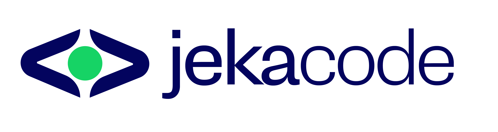

<p align="center">
  
</p>

<h1 align="center">Jekacode AI Engineering</h1>

<p align="center">
  <strong>A 12-week beginner programme.</strong><br/>
  From “what is AI?” to a live product you can show.
</p>

<p align="center">
  VS Code · Python · Ollama · Gemini · DeepSeek · Hugging Face · Gradio · Streamlit · HTML
</p>

---

## Read this first (even if you are 12)

Imagine a very well-read friend. This friend has read books, websites, and homework from all over the world. You ask a question. They answer with words.

That friend is a kind of computer programme called a **Large Language Model** (LLM). **Ollama** (on your laptop), **Gemini**, and **DeepSeek** are three of those friends. **Hugging Face** is the market where many extra models live — including **YarnGPT** for Nigerian voices.

**Artificial Intelligence (AI)** is the big field. It means “computers that can do things that used to need human thinking.”

**Generative AI** is the part that *makes* things: text, pictures, ideas, quiz questions.

An **AI Engineer** is a person who does not only chat with the friend. They build a useful app around the friend — for a school, a shop, a farm, a hospital desk, a student.

This course teaches you that job, slowly.

```
You type something
        ↓
Your Python app (or HTML chat) sends it
        ↓
Ollama on your laptop  —or—  Gemini / DeepSeek in the cloud
        ↓
The AI replies
        ↓
Notebook, Gradio, Streamlit, or a real HTML chat bubble
```

You do **not** need to be good at maths. You do **not** need to have coded before. You do need curiosity, a laptop, and patience when a red error appears.

---

## What this classroom uses

| We use | We do not use |
|---|---|
| [VS Code](https://code.visualstudio.com) | Cursor as the required editor |
| Python 3.11+ | Heavy machine-learning maths in Week 1 |
| **Ollama** first (local Llama) | 70B models on a school laptop |
| **Gemini** + **Grok** | OpenAI as a required API |
| **DeepSeek** | OpenRouter |
| **Hugging Face** + **Gradio** | Pretending YarnGPT always fits in 4GB RAM |
| Streamlit **and** a real **HTML/CSS** chatbot | Fancy frontend frameworks before Week 4 |
| GitHub fork → push → **Pull Request** | Dumping secrets in `.env` on GitHub |

Official colours (from the [Jekacode logo](https://www.jekacode.africa/images/jekacode.png)):

- Navy `#03045E`
- Green `#16D365`
- Black `#000000`

---

## Start here

1. **How to install everything:** **[guides/HOW_TO.md](guides/HOW_TO.md)** (Ollama, Gemini key, Grok key, Gradio, `.env`, n8n, deploy)
2. Setup folder: **[setup/README.md](setup/README.md)**
3. How a week works: **[guides/THREE_CLASSES.md](guides/THREE_CLASSES.md)** (`day1` / `day2` / `day3`)
4. Fork, push, PR: **[guides/fork_push_pr.md](guides/fork_push_pr.md)**
5. Pictures: **[visuals/README.md](visuals/README.md)** (includes **latency**)
6. Terms: **[guides/AI_ENGINEERING_TERMS.md](guides/AI_ENGINEERING_TERMS.md)**
7. Test Gemini / Grok / others: **[setup/test_all_models.ipynb](setup/test_all_models.ipynb)**
8. **[setup/check_setup.ipynb](setup/check_setup.ipynb)**
9. Begin **[week01-intro-to-ai/day1.ipynb](week01-intro-to-ai/day1.ipynb)** — each week README starts with goals, tools, how-to, and what happens behind the scenes

Shelf of extra links: **[RESOURCES.md](RESOURCES.md)**

---

## 12-week map (basic → high)

| Week | Folder | You will be able to | Project |
| ---: | --- | --- | --- |
| 1 | [week01-intro-to-ai](week01-intro-to-ai) | Explain AI + software vs AI engineer; run **Ollama** | Use-case explorer |
| 2 | [week02-python](week02-python) | Input → process → output in Python | Student Performance Analyzer |
| 3 | [week03-llm-apis](week03-llm-apis) | Call Ollama, Gemini, DeepSeek, Hugging Face | Writing assistant + page summarizer |
| 4 | [week04-ai-apps](week04-ai-apps) | Streamlit, **Gradio**, **HTML/CSS chatbot** | Study assistant or chat UI |
| 5 | [week05-prompt-engineering](week05-prompt-engineering) | Chat vs engineered workflows | Business assistant |
| 6 | [week06-rag](week06-rag) | Answers from *your* documents | Chat with handbook / PDF |
| 7 | [week07-agents](week07-agents) | One agent, tools | Research assistant |
| 8 | [week08-automation](week08-automation) | Trigger → AI → action | Email / support workflow |
| 9 | [week09-african-problems](week09-african-problems) | Real problem + **YarnGPT** local language | Canvas + voice notice |
| 10 | [week10-deploy](week10-deploy) | GitHub + live link + Spaces | Deployed AI app |
| 11 | [week11-responsible-ai](week11-responsible-ai) | Break it on purpose | Evaluation report |
| 12 | [week12-capstone](week12-capstone) | Demo + portfolio | Capstone |

Each week is **three files**: `day1.ipynb` (theory) · `day2.ipynb` (lab) · `day3.ipynb` (project). Official outline lives in that week’s README.

Extras (summarizer, YarnGPT, HTML chat): [interesting-projects/README.md](interesting-projects/README.md).

---

## How to learn (the Jekacode 5 steps)

1. **Watch** one short concept video (teachers have the list)
2. **Follow** the lab notebook
3. **Close** the notebook and rebuild from memory
4. **Change** it into a Nigerian / African version
5. **Teach** one idea to a classmate in two minutes

If you only watch, you will forget. If you build, you will keep it.

---

## Where your work goes

Create `projects/YOUR_GITHUB_USERNAME/` (copy `_template/` if you want empty folders).

**See a finished example:** [projects/solarinayo/](projects/solarinayo/) — five README lines every week, a working Week 2 script, a sample capstone. Copy the *shape*, not the sentences.

GitHub is how you **fork**, **push**, and open a **Pull Request**. Full steps with pictures: [guides/fork_push_pr.md](guides/fork_push_pr.md).

Do not commit your `.env` file. Keys stay on your computer.

---

<p align="center">
  
  <br/>
  <sub>Jekacode · Africa · Learn by building</sub>
</p>
